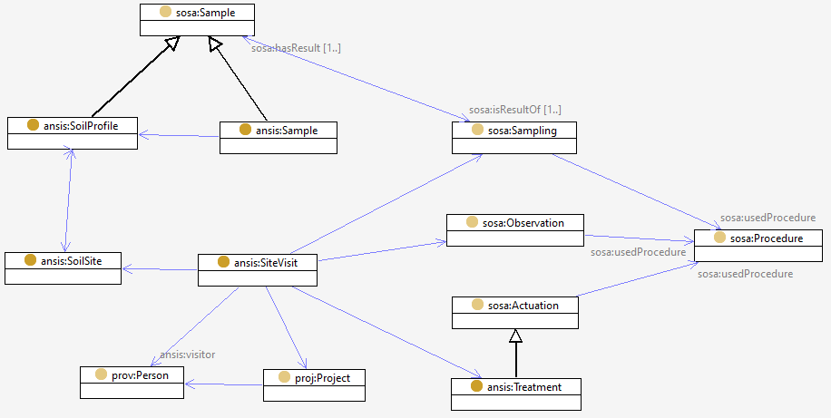

# Site visit

A visit to a [site](site.md) for the purpose(s) of one or more sub-activities, including [making observations](sosa.md), [selecting and taking samples, including profiles](sosa.md), and [applying treatments or making interventions](sosa.md). 

Establishing the site might be considered to be the first act of sampling. 

