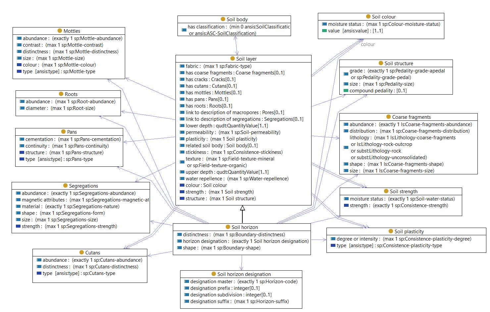

# Soil layer and soil horizon

Laterally extensive region within a soil body, approximately parallel with the surface. 

*Soil horizon*

A soil horizon is a layer of soil, approximately parallel to the land surface, with morphological properties different from layers below and/or above it.  Soil horizons are designated A1, B2, R etc. 

The properties of the lower boundary are part of the horizon description. 

*Soil layers*

Soil layers are a thickness defined layer within a soil body. 

Soil layers are characterised through [observations](sosa.md) made on [samples](sosa.md) obtained from [soil profiles](soil-profile.md) in [visits](site-visit.md) to [soil sites](site.md). 

A layer is not necessarily homogenous in its properties - some properties of a layer will vary with location or position within the soil body.

A depth-defined layer could be considered a sample of a soil-body.

(text from [ASLS](https://catalogue.nla.gov.au/Record/4273240))

> **Soil Horizons**
>
>A soil horizon is a layer of soil, approximately parallel to the land surface, with morphological properties different from layers below and/or above it. Tongues of material from one horizon may penetrate into adjacent horizons. Give horizon notation as described below.
>
> As horizon notation is deduced from the profile description data (Northcote 1979) and in some instances laboratory data, record it after the profile is described. Horizons may be difficult to name, but should be named in the field. Opinions formed at the time of description are useful for later reference.
>
>With regard to horizon notation, the long-established usage in horizon designation is adopted. Emphasis is on factual objective notation rather than assumed genesis, as genetic implications are often uncertain and difficult to establish. Thus the notation E indicating eluvial horizon (International Society of Soil Science 1967) has not been used, even though this has been adopted by a number of overseas organisations, for example Hodgson (1974), Soil Survey Staff (1990).
>
>_O Horizons_ 
>These are horizons dominated by organic materials in varying stages of decomposition that have accumulated on the mineral soil surface. They are usually divided into O1 and O2 horizons.
>O1	horizon	consists of undecomposed organic debris, usually dominated by leaves and twigs. The original form of the debris can be recognised with the naked eye.
>O2	horizon	consists of organic debris in various stages of decomposition. The original form of most of the debris cannot be recognised with the naked eye.
>
>_P Horizons_ 
>These are horizons dominated by organic materials in various stages of decomposition that have accumulated either under water or in conditions of excessive wetness. They have long been known as peat. The organic material consists of the remains of plants that have been growing in place. They may be divided into P1 and P2 horizons as in O1 and O2 above.
>
>When such horizons are buried, they may be designated in a manner similar to designations for buried mineral soils (page 112), for example 2P1, 3P2, etc.
>P1	horizon	consists primarily of undecomposed or weakly decomposed organic material (fibric peat). Plant remains are distinct and readily identifiable.
>P2	horizon	consists primarily of moderately to completely decomposed organic material (hemic to sapric peat). Plant remains vary from being difficult to identify to completely amorphous.
>
>_A Horizons_ 
>These are horizons either consisting of one or more surface mineral horizons with some organic accumulation and usually darker in colour than the underlying horizons, or consisting of surface and subsurface horizons that are lighter in colour but have a lower content of silicate clay and/or sesquioxides than the underlying horizons.
>A1	horizon	mineral horizon at or near the soil surface with some accumulation of humified organic matter, usually darker in colour than underlying horizons and with maximum biologic activity for any given soil profile. It may be divided into subhorizons and of these the A11 horizon is usually the more organic, or darker coloured uppermost portion. The A12 differs in either hue, value or chroma from the A11, usually being lighter in colour. It is not pale enough to qualify as an A2 horizon. The A1 may be further divided into subhorizons if necessary, for example A13, A14, etc.
>A2	horizon	mineral horizon having, either alone or in combination, less organic matter, sesquioxides, or silicate clay than immediately adjacent horizons. It is usually differentiated from the A1 horizon by its paler colour, that is, by having colour value at least one unit higher and usually less organic matter. It is usually differentiated from the B horizon by having colour value at least one unit higher and chroma at least two units lower, by coarser texture or by a combination of these attributes.
>A3	horizon	transitional horizon between A and B, which is dominated by properties characteristic of an overlying A1 or A2.
>
>_B Horizons_ 
>These are horizons consisting of one or more mineral soil layers characterised by one or more of the following: a concentration of silicate clay, iron, aluminium, organic material or several of these; a structure and/or consistence unlike that of the A horizons above or of any horizons immediately below; stronger colours, usually expressed as higher chroma and/or redder hue, than those of the A horizons above or those of the horizons below.
>B1	horizon	transitional horizon between A and B, which is dominated by properties characteristic of an underlying B2.
>B2	horizon	horizon in which the dominant feature is one or more of the following:
>•	an illuvial, residual or other concentration of silicate clay, or iron, aluminium or humus, either alone or in combination
>•	maximum development of pedologic organisation* as evidenced by a different structure and/or consistence, and/or stronger colours than the A horizons above or any horizon immediately below.
>It may be divided into subhorizons, for example B21, B22, B23.
>B3	horizon	transitional horizon between B and C or other subsolum material in which properties characteristic of an overlying B2 dominate, but intergrade to those of the underlying material.
>
>_C Horizons_ 
>These are layers below the solum (AB profile) of consolidated or unconsolidated material, usually partially weathered, little affected by pedogenic processes, and either like or unlike the material from which the solum presumably formed. The C horizon lacks properties characteristic of O, P, A, B or D horizons. It is recognised by its lack of pedological development and/or the presence of geologic organisation frequently expressed as sedimentary laminae or as ghost rock structure as in saprolite. C horizons include consolidated rock and sediments that, when moist, can be dug with hand tools. Rock strength is generally weak or weaker. Because of their nature, C horizons may be described as detailed in this chapter or as substrate (see page 153).
>
>_D Horizons_ 
>These are considered here to be any soil material below the solum that is unlike the solum in its general character, is not C horizon, and cannot be given reliable horizon designation as described in ‘Buried soils’ or ‘Lithologic discontinuities’ (see pages 110 and 112). Thus a D horizon may be recognised by the contrast in pedologic organisation between it and the overlying horizons.
>
>_R Horizons_ 
>These horizons consist of continuous masses (not boulders) of moderately strong to very strong rock (excluding pans, page 143) such as bedrock. R horizons may have cracks but these are few enough and/or fine enough that few roots penetrate and there is no significant displacement of rock. It is usually too strong to dig with hand tools, even when moist.
>
>_Transitional horizons_
>Two main kinds are distinguished:
>•	transitional horizons that have subordinate properties of both horizons but are not dominated by properties characteristic of either horizon. For example, AB, AC, BC horizons.
>•	transitional horizons in which distinct parts have recognisable properties of two kinds of horizons indicated by capital letters (Soil Survey Staff 1990). The two capital letters are separated by a virgule (/) as A/B, A/C, B/C. Most of the individual parts of at least one of the components are surrounded by the other.
>The first symbol is that of the horizon that makes up the greater volume.
>
>_Bleached horizons_
>Some horizons are white, near white or much paler than adjacent horizons. Bleached horizons most commonly occur as A2 horizons but are not restricted to them.
>Bleached horizons are defined in terms of Munsell notations for dry soil:
>•	for all hues, value 7 or greater with chroma 4 or less
>•	where adjacent horizons have hues 5YR or redder, value 6 or greater with chroma 4 or less.
>
>Two kinds of bleached horizons are recognised:
>_Conspicuously bleached_: 80% or more of the horizon is bleached.
>_Sporadically bleached_: bleach occurs:
>•	irregularly through the horizon
•	as blotches, often less than 6 mm thick, at the interface of horizons, most commonly A and B horizons
•	as nests of bleached grains of soil material at the interface of horizons, most commonly A and B horizons, when no other evidence of a bleached horizon may occur.
