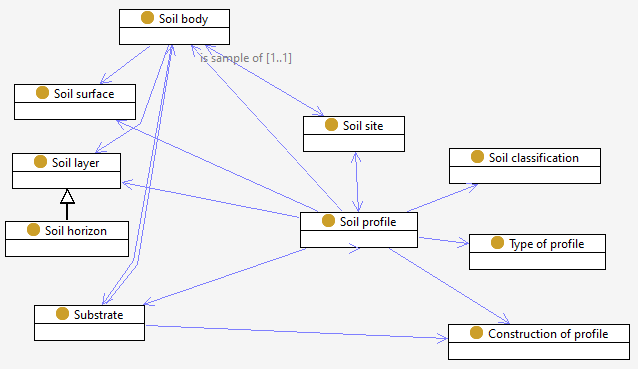

# Soil profile

A Soil Profile is a vertical section of a [soil body](soil-body.md) from the soil surface through all its [horizons](soil-layer.md) to parent material, other consolidated substrate material or selected depth in unconsolidated material.

The intention of a soil profile is to sample a [soil body](soil-body.md). 

The procedure through which the profile was created at a [Soil Site](site.md).

Soil profiles can be created through a variety of procedures, such as those listed in ([ASLS](https://catalogue.nla.gov.au/Record/4273240)) - ( soil pit | existing vertical exposures | relatively undisturbed soil cores | auger boring ).

Soil profile types include ( single | characterisation (reference or norm) | composite ). 

[Soil samples](soil-sample.md) are taken in soil profiles. 
Where samples are composited from several physical profiles, we associate these with a 'composite profile' composed of two or more single profiles at a site. 
[Observations](sosa.md) are made on the samples, that allow the body to be characterised. The geometry of a composite soil-profile is a polygon or set of points. 

Soil profiles may be be classified using the order-suborder-greatgroup-subgroup-family system. 

(text from [ASLS](https://catalogue.nla.gov.au/Record/4273240))

> **Soil Profile**
>
>A soil profile is a vertical section of a soil from the soil surface through all its horizons to parent material, other consolidated substrate material or selected depth in unconsolidated material.
>
>A soil profile can be seen as an individual (Macvicar 1969 page 143; Northcote 1979 page 22) that is described by giving a single value to each property. This is distinct from the pedon (Soil Survey Staff 1975), a three-dimensional soil body that can only be described by a range of values for each property. Considering the variability inherent in soils, ideally a soil description would give a range of values for each property recorded in each of the three dimensions in each horizon. In practice this is not possible as the pedologist can describe factually only the very small parts of the soil body actually seen. Most soil descriptions are given with a single value for each property described and thus refer to soil profiles.
>
> _Type of soil observation_
>
>The soil profile may be described from the following (listed in order of preference):
>
>P	Soil pit
>
>E	Existing vertical exposure
>
>C	Relatively undisturbed soil core
>
>A	Auger boring
>
>To characterise a soil profile fully, it should be examined to the depth of the parent material or other consolidated material. However, because soil depth varies between very wide limits and because soils are examined for a wide variety of purposes, the depth of examination in practice frequently may not exceed 1.5–2 m.
