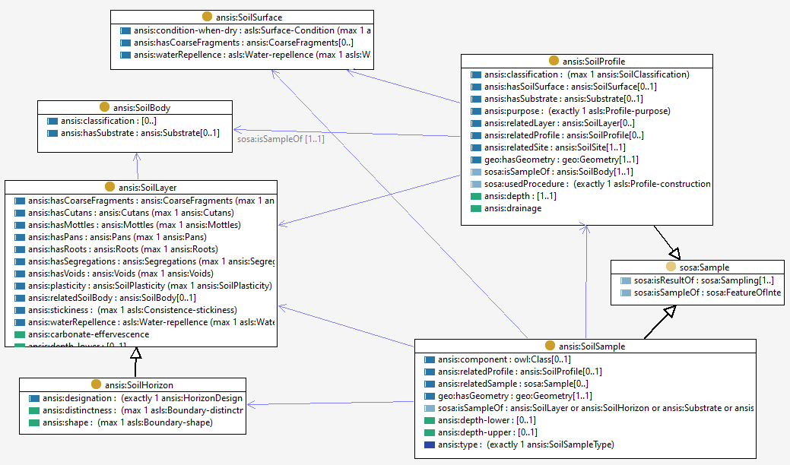

# Soil Sample

A soil sample may be of soil material or a soil entity. 
A soil sample is always associated with a [soil profile](soil-profile.md), and typically samples a [layer or horizon](soil-layer.md) or other soil entity.
[Observations](sosa.md) are made on soil samples in order to characterise the material or entity that it is a sample of.  

The location of the soil sample is taken from the location of the [soil profile](soil-profile.md) and its depth within the profile. 
The primary types of soil sample are 
- in situ - either _in situ_ in the field or _in place_ in a recovered core 
- material sample - removed from the site or core in order to allow observations which may be made off-site, for example in a laboratory.  
- composite sample - associated with a (virtual) composite profile, which is just a set of two or more profiles from a site. 

The observable properties of a soil sample are the properties of the type of entity that it is a sample of. Soil samples serve as the proximate entity-of-interest for observations of the properties of a soil entity. 

