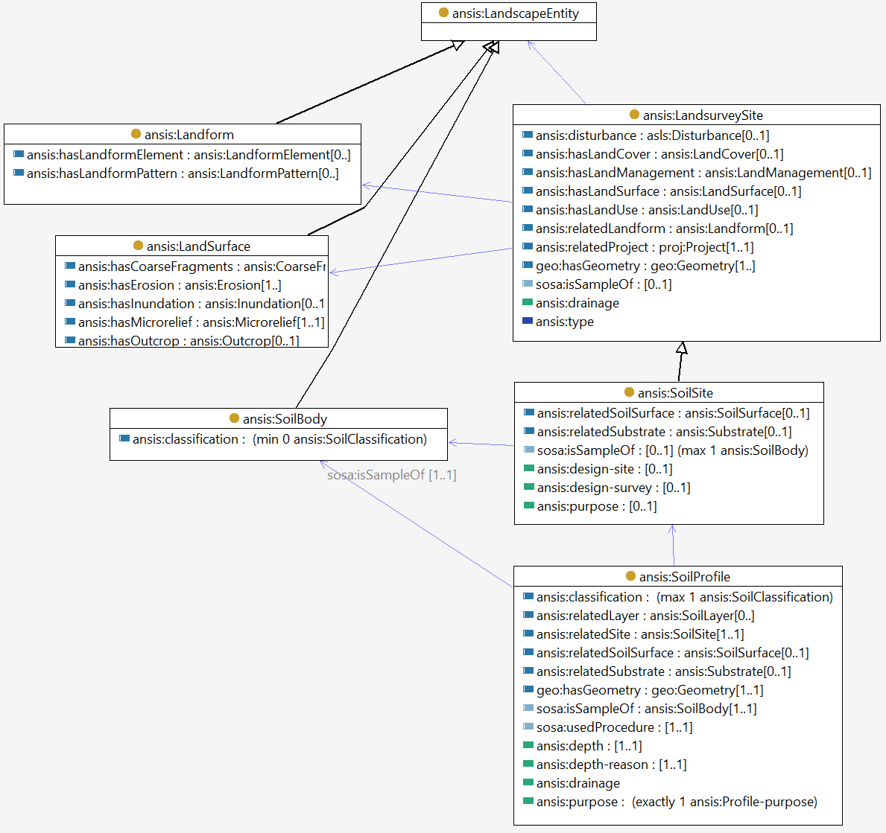

# Soil and land survey sites

A Land Survey Site is established to make observations of landscape entitites. 

A Soil Site is a specialization focusing on soils. 
In particular a Soil Site is intended to sample a [soil body](soil-body.md) through one or more [soil profiles](soil-profile.md). 

# A Soil Site

Acts as a kind of platform, where sensors may be deployed.

Is a geospatial entity (feature) which has a geometry (incl. location).

May be considered as a kind of Sample, since it is selected to be representative of a landscape entity.

May be large or small and may have sub-sites or additional locations associated with it.

Can be a general term that encompasses locations that may be called ‘plot’, ‘station’, ‘transect’, ‘quadrat’, 'farm site', 'paddock' etc.

Many kinds of projects can be carried out at a "Soil Site" including in ecology, agronomy and land capability.

(text from [ASLS](https://catalogue.nla.gov.au/Record/4273240))

> **The site concept**
>
> A site is a small area of land considered to be representative of the landform, vegetation, land surface and other land features associated with the soil observation.
>
> The extent of a site is arbitrary but certain dimensions are appropriate for certain attributes.
>
> Observe landform element attributes over a circle of 20 m radius (1256 m2) and landform pattern attributes over a circle of 300 m radius (28.3 ha). Sample vegetation in a square or rectangular site of 400 m2. In sites dominated by ground layer, several 20–50 m2 samples or 10–20 m transects are used. Observe most land surface attributes within a site 10 m in radius (315 m2); these attributes are: slope, aspect, disturbance of site, microrelief, surface coarse fragments, rock outcrop and runoff. A few land surface attributes refer simply to the point of soil observation, namely elevation, drainage height and depth to free water; the attributes erosion, aggradation and inundation refer to the larger 20 m radius site used for landform element attributes.
>
> In some instances a soil observation may be representative only of a soil body smaller than 10 m in radius. For example, in some gilgai the vegetation, land surface and soil all differ between the mound and depression. In such instances the extent of the site for those features is only that of the mound or the depression.

# A Soil Site
acts as a kind of platform, where sensors may be deployed
is a geospatial entity (feature) which has a geometry (incl. location)
may be considered as a kind of Sample, since it is selected to be representative of a landscape entity
may be large or small and may have sub-sites or additional locations associated with it.
can be a general term that encompasses locations that may be called ‘plot’, ‘station’, ‘transect’, ‘quadrat’, 'farm site', 'paddock' etc.
many kinds of projects can be carried out at a "Soil Site" including in ecology, agronomy and land capability
