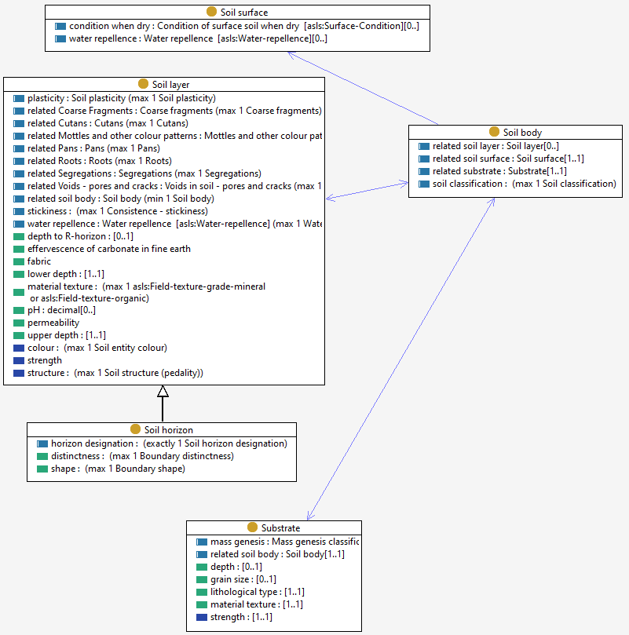

# Soil body
A Soil Body is part of the soil cover that is delineated at a scale useful for an application, and is relatively homogeneous with regard to certain soil properties and/or spatial patterns. 

A Soil Body is bounded above by the surface and below by the [R-Horizon](soil-layer.md) or substrate, and is usually described as a sequence of [soil layers](soil-layer.md), or arrangement of [soil horizons](soil-layer.md). This may be a single layer.  

'Soil individual' and 'Pedon' are related terms used for Soil Bodies.

'Soil mapping unit' can be a single soil (soil body) or not (an association/complex).

Soil bodies are characterised through [observations](sosa.md) made on [soil profiles](soil-profile.md) at [soil sites](site.md). 

Note: [Soil Horizon](soil-layer.md) is a special kind of layer, defined on pedological grounds. 
Note: A Soil Body is usually characterized by observations made in a [Soil Profile](soil-profile.md).
