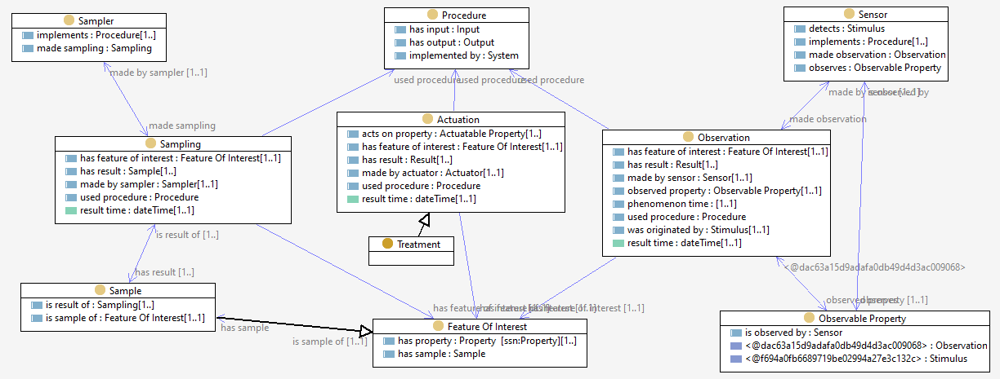

# Sampling, Observations, and Treatments

We use a standard cross-domain model for Observations, Sampling and Actuation described in the [SSN Ontology](https://www.w3.org/TR/vocab-ssn/) and an [extension for proximte vs ultimate feature-of-interest](https://www.w3.org/TR/vocab-ssn-ext/#ultimate-feature-of-interest). 

A sampling, observation or actuation activity always uses a **Procedure** and concerns an **Entity of Interest** (called _Feature of Interest_ in the standard). 
The **Sampler**, **Sensor** (Observer) or **Actuator**, that implements the Procedure, may be a **person**. 

The result of a **Sampling** is a **Sample** of the **entity of interest**. 

The result of an **Observation** is a **piece of information** - usually a number or a term, which is the value of the **observed property** relating to the **entity of interest**. 

The _proximate_ entity-of-interest of an observation is almost always a _Sample_ of the _ultimate_ entity-of-interest.
Recording the link from the Sample to the sampled-entity is key to using the result of an observation. 

The **resultTime** is the date and time that the act was completed. 
The **phenomenonTime** is the date and time that the result of an observation applies to the entity-of-interest, which could be a sampling-time that may be significantly prior to the observation-time. 

The result of an **Actuation** is a change of value of some **actuatable property** relating to the **entity of interest**. Treatments such as application of lime or a fertilizer are a kind of Actuation. 

